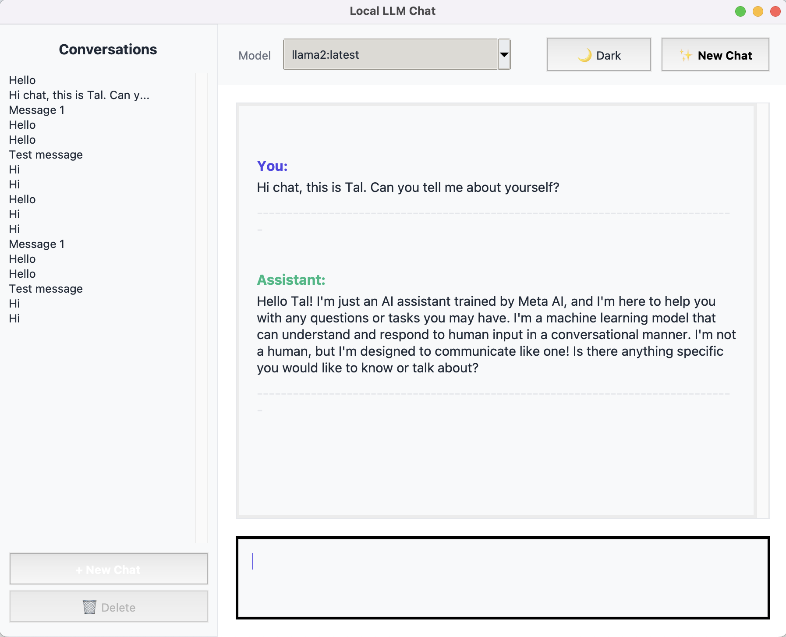
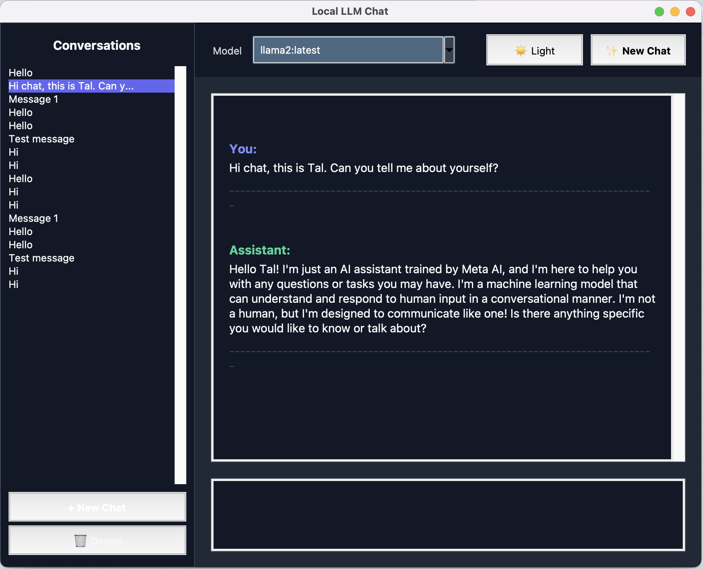

# Local LLM Desktop Chat Application

A desktop chat application that connects to local LLM models via the Ollama API. Chat privately with AI models running entirely on your machine.

## Table of Contents

- [Features](#features)
- [Prerequisites](#prerequisites)
- [Installation](#installation)
- [Usage](#usage)
  - [Starting the Application](#starting-the-application)
  - [Using the Chat Interface](#using-the-chat-interface)
  - [Example Conversation](#example-conversation)
- [Screenshots](#screenshots)
- [Project Structure](#project-structure)
- [Code Overview](#code-overview)
  - [Key Components](#key-components)
  - [How It Works](#how-it-works)
- [Testing](#testing)
  - [Running Tests](#running-tests)
  - [Expected Test Output](#expected-test-output)
  - [Test Coverage](#test-coverage)
  - [Test Structure](#test-structure)
  - [What's Tested](#whats-tested)
  - [Writing New Tests](#writing-new-tests)
- [Troubleshooting](#troubleshooting)
  - [Cannot connect to Ollama](#cannot-connect-to-ollama)
  - [No models found](#no-models-found)
  - [Application won't start](#application-wont-start)
  - [macOS Tkinter Error](#macos-tkinter-error-macos-15-1507-or-later-required)
- [Configuration Options](#configuration-options)
- [MVP Scope (Current Features)](#mvp-scope-current-features)
- [Future Enhancements (Post-MVP)](#future-enhancements-post-mvp)
- [Requirements](#requirements)
- [License](#license)
- [Contributing](#contributing)
- [Acknowledgments](#acknowledgments)

## Features

- **Private & Local**: All conversations happen on your machine - no data sent to external servers
- **Real-time Streaming**: See AI responses as they're generated
- **Multiple Models**: Switch between different Ollama models on the fly
- **Modern UI Design**: Clean, contemporary interface with professional styling
  - Light and Dark theme support
  - High-contrast colors for excellent readability
  - Smooth hover effects on interactive elements
  - Card-based layout with comfortable spacing
  - Modern typography (Segoe UI font)
- **Conversation Management**:
  - Start new chats and maintain conversation context
  - **Conversation History Sidebar**: Browse and access all your past conversations
  - **Persistent Storage**: All conversations are automatically saved to disk
  - **Quick Switching**: Click any conversation to instantly load it
  - **Delete Conversations**: Remove conversations you no longer need
  - Conversations are titled automatically from the first message

## Prerequisites

1. **Python 3.10 or higher** installed on your system (Python 3.12+ recommended)

   **macOS Users**: If you're on macOS Sequoia (15.0+), use Homebrew Python to avoid Tkinter compatibility issues:
   ```bash
   brew install python@3.12
   ```
   Then use `python3.12` instead of `python3` for all commands below.

2. **Ollama** installed and running
   - Download from: https://ollama.ai
   - Install and start the Ollama service

3. **At least one model pulled** in Ollama:
   ```bash
   ollama pull llama2
   # or
   ollama pull mistral
   # or
   ollama pull codellama
   ```

## Installation

1. **Clone or download this repository**
   ```bash
   git clone https://github.com/YOUR_USERNAME/llm-desktop-chat.git
   cd llm-desktop-chat
   ```

2. **Create a virtual environment** (recommended):

   For most systems:
   ```bash
   python3 -m venv venv
   source venv/bin/activate  # On Windows: venv\Scripts\activate
   ```

   For macOS Sequoia users with Homebrew Python:
   ```bash
   python3.12 -m venv venv
   source venv/bin/activate
   ```

3. **Install Python dependencies**:
   ```bash
   pip install -r requirements.txt
   ```

4. **Optional: Create a `.env` file for custom configuration**:
   ```bash
   cp .env.example .env
   ```

   Edit `.env` to customize settings:
   ```bash
   OLLAMA_BASE_URL=http://localhost:11434
   DEFAULT_MODEL=llama2
   WINDOW_WIDTH=900
   WINDOW_HEIGHT=700
   ```

## Usage

### Starting the Application

**Easiest method** - Use the startup script:
```bash
./start.sh
```

This script automatically activates the virtual environment and launches the application.

**Alternative methods**:

1. Activate venv first, then run:
   ```bash
   source venv/bin/activate  # On Windows: venv\Scripts\activate
   python -m src.main
   ```

2. Run directly with venv Python:
   ```bash
   venv/bin/python -m src.main
   ```

**Important**: Don't use `python3 -m src.main` directly without activating the venv first, as it may use your system Python which could have an incompatible Tkinter version.

### Using the Chat Interface

1. **Browse Conversations**: The left sidebar shows all your saved conversations
2. **Load a Conversation**: Click any conversation in the sidebar to load it
3. **Select a Model**: Use the dropdown in the top toolbar to choose your model
4. **Toggle Theme**: Click the "🌙 Dark" or "☀️ Light" button to switch between light and dark themes
5. **Type Your Message**: Enter your message in the text box at the bottom
6. **Send**: Click "Send →" or press Enter (Shift+Enter for new line)
7. **View Response**: Watch the AI's response stream in real-time with modern styling
8. **New Chat**: Click "+ New Chat" in the sidebar to start a fresh conversation
9. **Delete**: Select a conversation and click "🗑️ Delete" to remove it

### Example Conversation

```
You: What is Python?
Assistant: Python is a high-level, interpreted programming language...
(Streaming response displays in real-time)

You: Write a hello world program in Python
Assistant: Here's a simple hello world program in Python:

print("Hello, World!")

That's it! Python's syntax is designed to be clean and readable...
```

## Screenshots

Visual guide to the modern application interface with conversation history feature.

### Light Theme with Conversation Sidebar



**Features shown**:
- **Conversation History Sidebar**: Left panel showing all saved conversations with auto-generated titles
- **Light Theme**: Clean, modern light color scheme with high contrast
- **Model Selector**: Dropdown to switch between Ollama models (llama2:latest shown)
- **Theme Toggle**: 🌙 Dark button to switch to dark mode
- **New Chat Button**: ✨ New Chat to start fresh conversations
- **Active Conversation**: Selected conversation highlighted in the sidebar
- **Delete Button**: 🗑️ Delete to remove conversations
- **Chat Display**: Card-based layout showing user and assistant messages
- **Input Area**: Message input field at the bottom

### Dark Theme with Conversation Sidebar



**Features shown**:
- **Dark Theme**: Professional dark color scheme for reduced eye strain
- **Same Layout**: Identical functionality with dark surfaces and text
- **Theme Toggle**: ☀️ Light button to switch back to light mode
- **Enhanced Readability**: Optimized text colors for dark backgrounds
- **Modern Accents**: Indigo and emerald color scheme adapted for dark mode
- **Conversation Persistence**: Same conversation list maintained across theme switches

### Demo Video

For a live demonstration of the application in action, see the [demo video](docs/images/demo-video.mov) showing:
- Real-time streaming responses
- Conversation switching via sidebar
- Theme toggling between light and dark modes
- Creating new conversations
- Model selection

## Project Structure

```
llm-desktop-chat/
├── src/
│   ├── main.py                 # Application entry point
│   ├── api/
│   │   └── ollama_client.py    # Ollama API client
│   ├── core/
│   │   ├── chat_manager.py     # Business logic
│   │   └── message.py          # Data models
│   ├── gui/
│   │   └── app.py              # Tkinter GUI with sidebar
│   ├── storage/
│   │   └── conversation_storage.py  # Conversation persistence
│   ├── config/
│   │   └── settings.py         # Configuration
│   └── utils/
│       ├── logger.py           # Logging setup
│       └── exceptions.py       # Custom exceptions
├── tests/
│   ├── test_message.py         # Message model tests
│   ├── test_chat_manager.py   # Chat manager tests
│   ├── test_ollama_client.py  # API client tests
│   ├── test_settings.py        # Settings tests
│   └── test_conversation_storage.py  # Storage tests
├── conversations/              # Saved conversations (JSON)
├── logs/                       # Application logs
├── requirements.txt
└── README.md
```

## Code Overview

### Key Components

1. **OllamaClient** (`src/api/ollama_client.py`)
   - Communicates with Ollama API
   - Handles streaming responses
   - Lists available models

2. **ChatManager** (`src/core/chat_manager.py`)
   - Manages conversation state
   - Orchestrates API calls
   - Maintains message history
   - Handles multiple conversation switching
   - Auto-saves conversations

3. **ConversationStorage** (`src/storage/conversation_storage.py`)
   - Persists conversations to disk as JSON files
   - Loads and lists saved conversations
   - Generates conversation titles from first message
   - Handles conversation deletion

4. **ChatApplication** (`src/gui/app.py`)
   - Tkinter-based user interface
   - Conversation history sidebar
   - Real-time message display
   - Input handling and validation
   - Theme switching support

5. **Message & Conversation** (`src/core/message.py`)
   - Data models for messages
   - Conversation management
   - API format conversion

### How It Works

```
User types message
    ↓
GUI captures input
    ↓
ChatManager adds user message to conversation
    ↓
OllamaClient sends request to Ollama API
    ↓
API streams response chunks
    ↓
GUI displays each chunk in real-time
    ↓
ChatManager adds complete response to conversation
```

## Testing

The project includes comprehensive unit tests covering all core functionality with 62 test cases.

### Running Tests

**Run all tests:**
```bash
source venv/bin/activate
pytest tests/ -v
```

**Run specific test file:**
```bash
pytest tests/test_message.py -v              # Message and Conversation tests
pytest tests/test_chat_manager.py -v         # ChatManager tests
pytest tests/test_ollama_client.py -v        # OllamaClient tests
pytest tests/test_settings.py -v             # Settings configuration tests
pytest tests/test_conversation_storage.py -v # ConversationStorage tests
```

**Run with coverage report:**
```bash
pytest tests/ --cov=src --cov-report=term-missing
```

**Run tests with detailed output:**
```bash
pytest tests/ -v -s
```

### Expected Test Output

When running the full test suite with `pytest tests/ -v`, you should see all 62 tests pass:

```
============================= test session starts ==============================
platform darwin -- Python 3.12.12, pytest-8.4.2, pluggy-1.6.0
cachedir: .pytest_cache
rootdir: /path/to/llm-desktop-chat
configfile: pytest.ini
plugins: anyio-4.11.0, cov-7.0.0
collected 62 items

tests/test_chat_manager.py::TestChatManager::test_initialization PASSED  [  1%]
tests/test_chat_manager.py::TestChatManager::test_start_new_conversation_default_model PASSED [  3%]
tests/test_chat_manager.py::TestChatManager::test_start_new_conversation_custom_model PASSED [  4%]
tests/test_chat_manager.py::TestChatManager::test_send_message_creates_conversation_if_none PASSED [  6%]
tests/test_chat_manager.py::TestChatManager::test_send_message_adds_user_message PASSED [  8%]
tests/test_chat_manager.py::TestChatManager::test_send_message_streams_response PASSED [  9%]
tests/test_chat_manager.py::TestChatManager::test_send_message_adds_assistant_response PASSED [ 11%]
tests/test_chat_manager.py::TestChatManager::test_send_message_calls_ollama_with_correct_params PASSED [ 12%]
tests/test_chat_manager.py::TestChatManager::test_send_message_handles_exception PASSED [ 14%]
tests/test_chat_manager.py::TestChatManager::test_set_model PASSED       [ 16%]
tests/test_chat_manager.py::TestChatManager::test_set_model_updates_conversation PASSED [ 17%]
tests/test_chat_manager.py::TestChatManager::test_get_messages_no_conversation PASSED [ 19%]
tests/test_chat_manager.py::TestChatManager::test_get_messages_with_conversation PASSED [ 20%]
tests/test_chat_manager.py::TestChatManager::test_clear_conversation PASSED [ 22%]
tests/test_chat_manager.py::TestChatManager::test_clear_conversation_no_conversation PASSED [ 24%]
tests/test_chat_manager.py::TestChatManager::test_multi_turn_conversation PASSED [ 25%]
tests/test_conversation_storage.py::TestConversationStorage::test_initialization PASSED [ 27%]
tests/test_conversation_storage.py::TestConversationStorage::test_save_conversation PASSED [ 29%]
tests/test_conversation_storage.py::TestConversationStorage::test_save_conversation_generates_title PASSED [ 30%]
tests/test_conversation_storage.py::TestConversationStorage::test_save_conversation_truncates_long_title PASSED [ 32%]
tests/test_conversation_storage.py::TestConversationStorage::test_load_conversation PASSED [ 33%]
tests/test_conversation_storage.py::TestConversationStorage::test_load_nonexistent_conversation PASSED [ 35%]
tests/test_conversation_storage.py::TestConversationStorage::test_list_conversations PASSED [ 37%]
tests/test_conversation_storage.py::TestConversationStorage::test_list_conversations_sorted_by_updated_at PASSED [ 38%]
tests/test_conversation_storage.py::TestConversationStorage::test_delete_conversation PASSED [ 40%]
tests/test_conversation_storage.py::TestConversationStorage::test_delete_nonexistent_conversation PASSED [ 41%]
tests/test_conversation_storage.py::TestConversationStorage::test_conversation_exists PASSED [ 43%]
tests/test_conversation_storage.py::TestConversationStorage::test_generate_title_no_user_messages PASSED [ 45%]
tests/test_conversation_storage.py::TestConversationStorage::test_save_updates_existing_conversation PASSED [ 46%]
tests/test_conversation_storage.py::TestConversationStorage::test_conversation_metadata_includes_timestamps PASSED [ 48%]
tests/test_conversation_storage.py::TestConversationStorage::test_message_preservation PASSED [ 50%]
tests/test_message.py::TestMessage::test_create_message PASSED           [ 51%]
tests/test_message.py::TestMessage::test_message_to_dict PASSED          [ 53%]
tests/test_message.py::TestConversation::test_create_conversation PASSED [ 54%]
tests/test_message.py::TestConversation::test_add_message PASSED         [ 56%]
tests/test_message.py::TestConversation::test_get_messages_for_api PASSED [ 58%]
tests/test_message.py::TestConversation::test_clear_conversation PASSED  [ 59%]
tests/test_ollama_client.py::TestOllamaClient::test_initialization PASSED [ 61%]
tests/test_ollama_client.py::TestOllamaClient::test_initialization_strips_trailing_slash PASSED [ 62%]
tests/test_ollama_client.py::TestOllamaClient::test_check_connection_success PASSED [ 64%]
tests/test_ollama_client.py::TestOllamaClient::test_check_connection_failure PASSED [ 66%]
tests/test_ollama_client.py::TestOllamaClient::test_list_models_success PASSED [ 67%]
tests/test_ollama_client.py::TestOllamaClient::test_list_models_empty PASSED [ 69%]
tests/test_ollama_client.py::TestOllamaClient::test_list_models_http_error PASSED [ 70%]
tests/test_ollama_client.py::TestOllamaClient::test_generate_stream_success PASSED [ 72%]
tests/test_ollama_client.py::TestOllamaClient::test_generate_stream_with_empty_content PASSED [ 74%]
tests/test_ollama_client.py::TestOllamaClient::test_generate_stream_invalid_json PASSED [ 75%]
tests/test_ollama_client.py::TestOllamaClient::test_generate_stream_http_error PASSED [ 77%]
tests/test_ollama_client.py::TestOllamaClient::test_generate_stream_request_payload PASSED [ 79%]
tests/test_ollama_client.py::TestOllamaClient::test_close_connection PASSED [ 80%]
tests/test_settings.py::TestSettings::test_default_values PASSED         [ 82%]
tests/test_settings.py::TestSettings::test_custom_ollama_base_url PASSED [ 83%]
tests/test_settings.py::TestSettings::test_custom_default_model PASSED   [ 85%]
tests/test_settings.py::TestSettings::test_custom_window_title PASSED    [ 87%]
tests/test_settings.py::TestSettings::test_custom_window_dimensions PASSED [ 88%]
tests/test_settings.py::TestSettings::test_custom_log_level PASSED       [ 90%]
tests/test_settings.py::TestSettings::test_custom_log_file PASSED        [ 91%]
tests/test_settings.py::TestSettings::test_case_insensitive_env_vars PASSED [ 93%]
tests/test_settings.py::TestSettings::test_multiple_custom_settings PASSED [ 95%]
tests/test_settings.py::TestSettings::test_invalid_window_width_type PASSED [ 96%]
tests/test_settings.py::TestSettings::test_invalid_window_height_type PASSED [ 98%]
tests/test_settings.py::TestSettings::test_settings_mutable_after_creation PASSED [100%]

============================== 62 passed in 0.25s ==============================
```

**What this output shows:**
- ✅ All 62 tests passed successfully
- ✅ Tests cover 5 modules: ChatManager (16 tests), ConversationStorage (15 tests), Message/Conversation (6 tests), OllamaClient (13 tests), Settings (12 tests)
- ✅ Execution time: ~0.25 seconds (very fast!)
- ✅ Progress indicators show percentage completion for each test

If you see any failures, check the detailed error messages and ensure:
1. Your virtual environment is activated
2. All dependencies are installed (`pip install -r requirements.txt`)
3. You're running tests from the project root directory

### Test Coverage

Current test coverage for core modules (as of latest test run):
- **ChatManager**: 100% coverage
- **Message & Conversation**: 100% coverage
- **ConversationStorage**: 100% coverage
- **OllamaClient**: 87% coverage
- **Settings**: 100% coverage
- **Exceptions**: 100% coverage
- **Logger**: 100% coverage

*Note: Run `pytest tests/ --cov=src --cov-report=term-missing` to see the latest coverage report.*

### Test Structure

```
tests/
├── __init__.py
├── test_message.py              # Tests for Message and Conversation models
├── test_chat_manager.py         # Tests for ChatManager business logic
├── test_ollama_client.py        # Tests for Ollama API client (with mocks)
├── test_settings.py             # Tests for configuration settings
└── test_conversation_storage.py # Tests for conversation persistence
```

### What's Tested

#### Message & Conversation (`test_message.py`)
- Message creation and serialization
- Conversation management
- Message history tracking
- API format conversion

#### ChatManager (`test_chat_manager.py`)
- Conversation lifecycle management
- Message sending and receiving
- Streaming response handling
- Model switching
- Multi-turn conversations
- Error handling

#### OllamaClient (`test_ollama_client.py`)
- API connection testing
- Model listing
- Streaming generation
- Request payload formatting
- Error handling and retries
- Invalid JSON handling

#### Settings (`test_settings.py`)
- Default configuration values
- Environment variable loading
- Custom configuration
- Type validation
- Case-insensitive environment variables

#### ConversationStorage (`test_conversation_storage.py`)
- Saving conversations to disk
- Loading conversations from storage
- Listing all conversations with metadata
- Deleting conversations
- Title generation from first message
- Title truncation for long messages
- Conversation persistence and updates
- Message ID and timestamp preservation
- Sorted conversation lists (most recent first)

### Writing New Tests

When adding new features, follow these guidelines:

1. **Create test file** matching the module name: `test_<module_name>.py`
2. **Use pytest fixtures** for common setup
3. **Mock external dependencies** (API calls, file I/O)
4. **Test edge cases** and error conditions
5. **Maintain coverage** above 80% for core modules

Example test structure:
```python
import pytest
from unittest.mock import Mock

class TestYourFeature:
    @pytest.fixture
    def setup(self):
        # Setup code
        return instance

    def test_basic_functionality(self, setup):
        # Test code
        assert result == expected
```

## Troubleshooting

### "Cannot connect to Ollama"

1. Verify Ollama is installed:
   ```bash
   ollama --version
   ```

2. Start Ollama service:
   ```bash
   ollama serve
   ```

3. Test Ollama is working:
   ```bash
   ollama list
   ```

### "No models found"

Pull a model:
```bash
ollama pull llama2
```

### Application won't start

1. Check Python version (must be 3.10+):
   ```bash
   python --version
   ```

2. Verify dependencies are installed:
   ```bash
   pip install -r requirements.txt
   ```

3. Check logs in `logs/app.log` for error details

### macOS Tkinter Error: "macOS 15 (1507) or later required"

This error occurs on macOS Sequoia when using the system Python with an outdated Tkinter version.

**Solution**:
1. Install Python via Homebrew:
   ```bash
   brew install python@3.12
   ```

2. Recreate your virtual environment with Homebrew Python:
   ```bash
   rm -rf venv
   python3.12 -m venv venv
   source venv/bin/activate
   pip install -r requirements.txt
   ```

3. Run the app:
   ```bash
   python -m src.main
   ```

**Why this happens**: macOS Sequoia (15.0+) requires Tkinter 9.0+, but system Python 3.9 includes an older version. Homebrew Python 3.12 includes the compatible Tkinter version.

## Configuration Options

All settings can be customized in `.env` file:

| Variable | Default | Description |
|----------|---------|-------------|
| `OLLAMA_BASE_URL` | `http://localhost:11434` | Ollama API endpoint |
| `DEFAULT_MODEL` | `llama2` | Model to use by default |
| `WINDOW_TITLE` | `Local LLM Chat` | Application window title |
| `WINDOW_WIDTH` | `900` | Window width in pixels |
| `WINDOW_HEIGHT` | `700` | Window height in pixels |
| `LOG_LEVEL` | `INFO` | Logging level (DEBUG, INFO, WARNING, ERROR) |
| `LOG_FILE` | `logs/app.log` | Path to log file |

## MVP Scope (Current Features)

- ✅ Single conversation interface
- ✅ Send and receive messages
- ✅ Streaming responses
- ✅ Model selection
- ✅ New chat functionality
- ✅ Connection error handling
- ✅ **Modern UI Design** with professional styling
- ✅ **Light & Dark Theme** support with seamless switching
- ✅ **Hover Effects** on interactive elements
- ✅ **High Contrast Colors** for excellent readability
- ✅ **Conversation History Sidebar** with persistent storage
- ✅ **Save/Load Conversations** automatically to disk
- ✅ **Delete Conversations** with confirmation dialog
- ✅ **Quick Conversation Switching** via sidebar

## Future Enhancements (Post-MVP)
- 💡 Message editing and regeneration
- 💡 Code syntax highlighting
- 💡 Export conversations (markdown, PDF)
- 💡 Custom system prompts
- 💡 Model parameter tuning (temperature, top_p)
- 💡 Keyboard shortcuts
- 💡 Rounded corners for buttons and inputs (limited by Tkinter)
- 💡 More theme options (custom color schemes)

## Requirements

**Python Version**: 3.10 or higher (3.12+ recommended for macOS Sequoia users)

See `requirements.txt` for full list. Main dependencies:

- `httpx` - HTTP client for API communication
- `pydantic` - Data validation and settings
- `pydantic-settings` - Settings management
- `python-dotenv` - Environment variable loading
- Tkinter - GUI framework (included with Python, requires version 9.0+ on macOS 15+)

## License

This project is provided as-is for educational and personal use.

## Contributing

This is a prototype/MVP. Feel free to fork and extend for your own use.

## Acknowledgments

- Built for use with [Ollama](https://ollama.ai)
- Designed for local, private AI conversations
